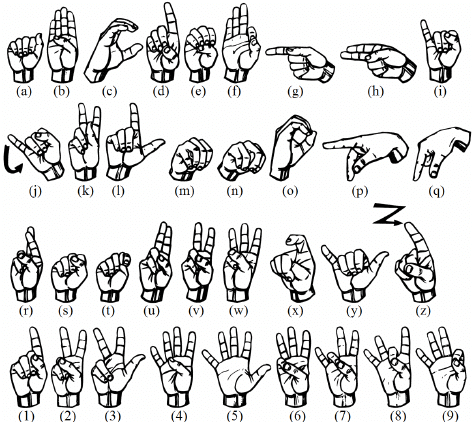
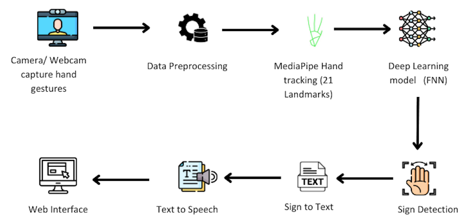

# 🤟 Real-Time Sign Language Detection Web App

A web-based real-time sign language recognition system built using Flask, TensorFlow, and MediaPipe. The application allows users to register/sign in and perform live detection of sign language gestures from webcam input, translating them into meaningful alphabets or words.

---

## 📌 Features

- User authentication (Sign up / Sign in)
- Real-time webcam-based sign language detection
- Deep learning model FNN
- Integrated MediaPipe for hand landmark tracking
- Responsive frontend 
- Clean UI built with HTML/CSS + Flask templating

---

## 🛠️ Tech Stack

- **Frontend**: HTML, CSS, JavaScript
- **Backend**: Python, Flask
- **ML Models**: TensorFlow / Keras
- **Hand Detection**: MediaPipe
- **Authentication**: Flask sessions
- **Webcam Integration**: OpenCV
- **Deployment**: Localhost (development server)

---

## 📊 Dataset

This project uses a **custom American Sign Language (ASL) dataset**, created by manually collecting images of hand gestures representing:

- Hand gestures for A-Z
- Digits 0–9

## 🔁⚙️ Workflow

